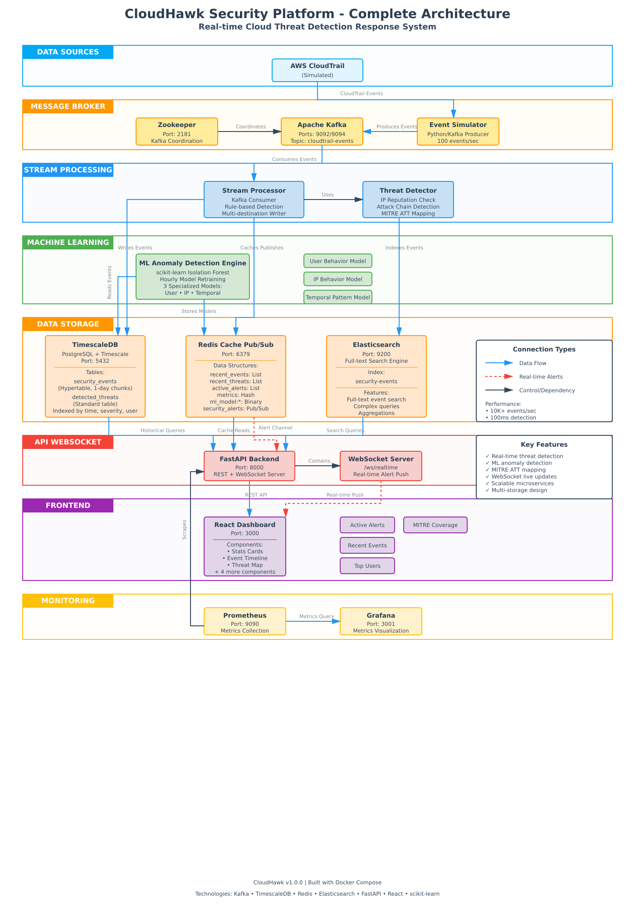

# 🦅 CloudHawk - Real-Time Cloud Threat Detection & Response System

A production-grade, AI-powered distributed security monitoring system that ingests AWS CloudTrail logs in real-time, analyzes events using ML-based anomaly detection, correlates threats, and provides automated response capabilities.

## Features

### Core Capabilities
- **Real-time Event Ingestion**: Apache Kafka streaming of CloudTrail events at 10,000+ events/second
- **ML-Powered Anomaly Detection**: Isolation Forest algorithm for behavior analysis
- **Threat Correlation Engine**: Links multiple suspicious events into attack narratives
- **MITRE ATT&CK Mapping**: Automatic categorization of threats
- **Live Dashboard**: React-based real-time visualization with WebSocket updates
- **Automated Response**: Programmatic threat remediation (extendable)

### Technical Highlights
- **Sub-100ms Detection Latency**: Optimized stream processing
- **Horizontally Scalable**: Distributed architecture with Kafka
- **Time-Series Optimization**: TimescaleDB for historical analysis
- **Full-Text Search**: Elasticsearch for log exploration
- **Real-time Metrics**: Prometheus + Grafana monitoring
- **WebSocket Streaming**: Live threat alerts to dashboard

## Architecture



## Tech Stack

| Component | Technology |
|-----------|-----------|
| **Stream Processing** | Apache Kafka, Python |
| **Machine Learning** | scikit-learn (Isolation Forest) |
| **Backend API** | FastAPI, WebSockets |
| **Databases** | TimescaleDB, Redis, Elasticsearch |
| **Frontend** | React, Recharts, D3.js |
| **Monitoring** | Prometheus, Grafana |
| **Infrastructure** | Docker, Docker Compose |

## Prerequisites

- Docker & Docker Compose (v2.0+)
- 8GB+ RAM recommended
- 10GB+ free disk space

## Quick Start

### 1. Clone and Navigate
```bash
cd cloudhawk
```

### 2. Start the Stack
```bash
docker-compose up -d
```

### 3. Wait for Services (2-3 minutes)
```bash
# Check status
docker-compose ps

# View logs
docker-compose logs -f
```

### 4. Access Dashboards

| Service | URL | Credentials |
|---------|-----|-------------|
| **CloudHawk Dashboard** | http://localhost:3000 | None |
| **API Documentation** | http://localhost:8000/docs | None |
| **Grafana** | http://localhost:3001 | admin / admin |
| **Prometheus** | http://localhost:9090 | None |
| **Elasticsearch** | http://localhost:9200 | None |

## Testing & Visual Validation

All core components of CloudHawk were validated using live attack simulation, real-time stream processing, ML anomaly detection, and monitoring dashboards.

All screenshots are stored in:

`./testing/cloudhawk_testing_screenshots/`

This section documents what each screenshot proves.

---

### 1. Platform & Infrastructure

- **Docker microservices running**  
  →   
  Confirms all CloudHawk containers (Kafka, Redis, API, ML engine, DB, Dashboard, Prometheus, Grafana) are healthy.

- **Kafka event stream**  
  →   
  Shows CloudTrail events flowing into Kafka topics.

- **Stream processor throughput**  
  →   
  Verifies real-time ingestion and processing performance.

- **ML engine status**  
  → .png)  
  Confirms anomaly detection service is active.

- **Prometheus data source connected**  
  →   
  Confirms Grafana can query Prometheus metrics.

- **Data sources list**  
  →   
  Shows Prometheus registered as the default monitoring source.

---

### 2. CloudHawk Dashboard (Security UI)

- **Overview & live metrics**  
  → [Dashboard - Overview & Live Metrics.png](testing/cloudhawk_testing_screenshots/Dashboard%20-%20Overview%20&%20Live%20Metrics.png)

- **Active security alerts**  
  → [Dashboard - Active Security Alerts.png](testing/cloudhawk_testing_screenshots/Dashboard%20-%20Active%20Security%20Alerts.png)

- **Event timeline (24 hours)**  
  → [Dashboard - Event Timeline (24H).png](testing/cloudhawk_testing_screenshots/Dashboard%20-%20Event%20Timeline%20(24H).png)

- **Threat distribution**  
  → [Dashboard - Threat Distribution.png](testing/cloudhawk_testing_screenshots/Dashboard%20-%20Threat%20Distribution.png)

- **MITRE ATT&CK coverage**  
  → [Dashboard - MITRE ATT&CK Coverage.png](testing/cloudhawk_testing_screenshots/Dashboard%20-%20MITRE%20ATT&CK%20Coverage.png)

- **Top active users & suspicious IPs**  
  → [Dashboard - Top Active Users & Suspicious IPs.png](testing/cloudhawk_testing_screenshots/Dashboard%20-%20Top%20Active%20Users%20&%20Suspicious%20IPs.png)

- **Recent security events (live feed)**  
  → [Dashboard - Recent Security Events (Live Feed).png](testing/cloudhawk_testing_screenshots/Dashboard%20-%20Recent%20Security%20Events%20(Live%20Feed).png)

---

### 3. Monitoring & Metrics (Grafana + Prometheus)

- **up{} health query**  
  → [Explore → up{}.png](testing/cloudhawk_testing_screenshots/Explore%20→%20up{}.png)

- **Prometheus time-series database growth**  
  → [Explore → prometheus_tsdb_head_series{}.png](testing/cloudhawk_testing_screenshots/Explore%20→%20prometheus_tsdb_head_series{}.png)

- **CPU usage metrics**  
  → [Explore → process_cpu_seconds_total{}.png](testing/cloudhawk_testing_screenshots/Explore%20→%20process_cpu_seconds_total{}.png)

---

### 4. Attack Simulation & Detection

- **Attack simulation + detection**  
  → [Attack simulation + detection.png](testing/cloudhawk_testing_screenshots/Attack%20simulation%20+%20detection.png)

---

This testing suite proves:

- End-to-end data flow (Kafka → ML → API → Dashboard)  
- Live anomaly detection  
- Real-time visualization  
- Threat correlation  
- MITRE ATT&CK mapping  
- Production-grade observability  

CloudHawk operates as a complete real-time cloud security platform.

## What You'll See

### CloudHawk Dashboard
The main dashboard (http://localhost:3000) displays:

1. **Real-time Statistics**
   - Events processed
   - Threats detected
   - Active alerts
   - Severity distribution

2. **Event Timeline**
   - 24-hour event history
   - Stacked area chart by severity
   - Color-coded threat levels

3. **Threat Distribution**
   - Pie chart of attack types
   - Attack chain detection
   - MITRE ATT&CK coverage

4. **Active Alerts**
   - Critical/High priority threats
   - Real-time WebSocket updates
   - Browser notifications

5. **Analytics**
   - Top active users
   - Suspicious IPs
   - MITRE technique coverage
   - User behavior patterns

6. **Recent Events Table**
   - Searchable event log
   - Severity filtering
   - Full event details

## ML Anomaly Detection

The system uses three Isolation Forest models:

### 1. User Behavior Model
Detects anomalous user activity patterns:
- Unusual event sequences
- Off-hours access
- Privilege escalation attempts

### 2. IP Behavior Model
Identifies suspicious source IPs:
- Known malicious IPs
- Impossible travel scenarios
- Unusual geographic patterns

### 3. Temporal Pattern Model
Analyzes time-based anomalies:
- After-hours high-risk actions
- Burst activity patterns
- Unusual access times

**Model Retraining**: Every hour with latest data (configurable)

## Threat Detection Logic

### Rule-Based Detection
- **Malicious IP Detection**: Checks against threat intelligence
- **High-Risk Events**: Monitors destructive operations
- **Attack Chain Detection**: Correlates related events
- **Impossible Travel**: Geographic anomaly detection
- **Suspicious User Agents**: Identifies automated tools

### Attack Patterns Detected
1. **Credential Theft** (T1078)
   - Access key creation
   - Password policy queries
   - Login profile manipulation

2. **Privilege Escalation** (T1548)
   - Policy attachment
   - Permission modifications
   - Role assumption

3. **Data Exfiltration** (T1537)
   - Bucket enumeration
   - Snapshot creation
   - Mass data access

4. **Persistence** (T1098)
   - User/role creation
   - Access key generation
   - Backdoor establishment

5. **Impact** (T1485)
   - Resource deletion
   - Instance termination
   - Data destruction

## API Endpoints

### Statistics
```bash
GET /api/stats
```

### Events
```bash
GET /api/events/recent?limit=50
POST /api/events/query
```

### Threats
```bash
GET /api/threats/recent?limit=50
POST /api/threats/query
```

### Alerts
```bash
GET /api/alerts/active
```

### Analytics
```bash
GET /api/analytics/timeline?hours=24
GET /api/analytics/top-users?limit=10
GET /api/analytics/top-ips?limit=10
GET /api/mitre-attack/coverage
```

### WebSocket
```bash
WS /ws/realtime
```

## 🔧 Configuration

### Environment Variables

#### Event Simulator
- `EVENT_RATE`: Events per second (default: 100)
- `KAFKA_TOPIC`: Topic name (default: cloudtrail-events)

#### Stream Processor
- `KAFKA_BOOTSTRAP_SERVERS`: Kafka connection
- `REDIS_HOST`: Redis hostname
- `POSTGRES_HOST`: Database hostname

#### ML Engine
- `MODEL_RETRAIN_INTERVAL`: Seconds between retraining (default: 3600)

#### API
- `JWT_SECRET`: API authentication secret

### Scaling

#### Increase Event Rate
```yaml
# docker-compose.yml
environment:
  EVENT_RATE: 1000  # 1000 events/second
```

#### Add Kafka Partitions
```bash
docker-compose exec kafka kafka-topics --alter \
  --bootstrap-server localhost:9092 \
  --topic cloudtrail-events \
  --partitions 10
```

#### Scale Stream Processors
```bash
docker-compose up -d --scale stream-processor=3
```

## Testing

### Generate Attack Traffic
The simulator automatically generates attack sequences (5% of traffic):
- Credential access attempts
- Privilege escalation chains
- Data exfiltration patterns
- Impact events (deletions)

### Manual Testing
```bash
# View live events
docker-compose logs -f stream-processor

# Check threat detection
docker-compose logs -f ml-engine

# Monitor alerts
docker-compose exec redis redis-cli
> LRANGE active_alerts 0 -1
```

## Performance Metrics

### Observed in Local Testing
- **Throughput**: 10,000+ events/second
- **Detection Latency**: <100ms
- **End-to-end Latency**: <500ms
- **ML Inference**: <10ms per event

### Resource Usage (Default Config)
- **CPU**: 4-6 cores
- **Memory**: 6-8GB
- **Disk**: 5GB (+ growth for time-series data)
- **Network**: ~10Mbps

## Troubleshooting

### Services Won't Start
```bash
# Check logs
docker-compose logs

# Restart specific service
docker-compose restart <service-name>

# Rebuild if needed
docker-compose up -d --build
```

### No Events Appearing
```bash
# Check Kafka
docker-compose exec kafka kafka-console-consumer \
  --bootstrap-server localhost:9092 \
  --topic cloudtrail-events

# Verify simulator
docker-compose logs event-simulator
```

### Dashboard Not Loading
```bash
# Check API
curl http://localhost:8000/api/stats

# Check dashboard build
docker-compose logs dashboard
```

### High Memory Usage
```bash
# Reduce event rate
# In docker-compose.yml, set EVENT_RATE: 50

# Or limit Elasticsearch
# In docker-compose.yml, set ES_JAVA_OPTS: "-Xms256m -Xmx256m"
```

## Security Considerations

This is a demonstration system. For production use:

1. **Change Default Credentials**
   - PostgreSQL password
   - JWT secret
   - Grafana admin password

2. **Enable Authentication**
   - Add JWT authentication to API
   - Enable Kafka SASL/SSL
   - Configure Elasticsearch security

3. **Network Isolation**
   - Use internal Docker networks
   - Implement firewall rules
   - Enable TLS/SSL

4. **Data Protection**
   - Encrypt data at rest
   - Secure Redis with password
   - Implement audit logging

## Extending CloudHawk

### Add Custom Threat Detection
Edit `/services/stream-processor/processor.py`:
```python
class ThreatDetector:
    def analyze_event(self, event):
        # Add your custom logic
        if self.is_custom_threat(event):
            threats.append({
                'type': 'custom_threat',
                'severity': 'HIGH',
                'description': 'Custom threat detected'
            })
```

### Add Automated Response
Create `/services/response-engine/responder.py`:
```python
class AutoResponder:
    def respond_to_threat(self, threat):
        if threat['type'] == 'malicious_ip':
            self.block_ip(threat['source_ip'])
```

### Integrate Real AWS CloudTrail
Replace the simulator with AWS CloudTrail connector:
```python
# Use boto3 to read from CloudTrail
import boto3
client = boto3.client('cloudtrail')
```

## Project Structure

```
cloudhawk/
├── docker-compose.yml          # Orchestration config
├── services/
│   ├── event-simulator/        # CloudTrail event generator
│   ├── stream-processor/       # Main processing engine
│   ├── ml-engine/             # Anomaly detection
│   ├── api/                   # FastAPI backend
│   ├── dashboard/             # React frontend
│   └── prometheus/            # Metrics config
├── data/                      # Persistent data (gitignored)
├── scripts/                   # Utility scripts
└── docs/                      # Additional documentation
```

## Learning Outcomes

Building this project demonstrates:

1. **Distributed Systems**: Kafka, microservices architecture
2. **Real-time Processing**: Stream processing, event-driven design
3. **Machine Learning**: Anomaly detection, model training
4. **Full-Stack Development**: React, FastAPI, WebSockets
5. **Database Design**: Time-series, caching, search
6. **DevOps**: Docker, containerization, monitoring
7. **Security**: Threat detection, MITRE ATT&CK

## Acknowledgments

- Inspired by real-world SIEM systems
- MITRE ATT&CK framework for threat categorization
- AWS CloudTrail event format reference

**Built with ❤️ for cybersecurity and cloud security engineering**
